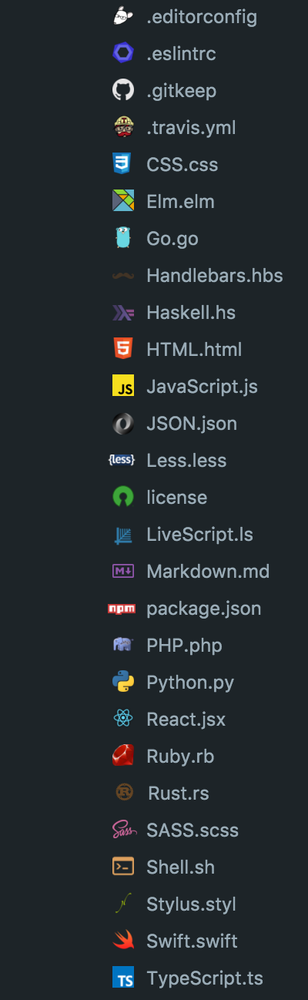

# Flexicons

[![Build Status][travis-image]][travis-url]
[![apm][apm-image]][apm-url]
[![devDependencies][depsdev-image]][depsdev-url]
[![Codecov.io][codecov-image]][codecov-url]

> A flexible full-color icon package for use in Atom.

## Screenshot



## Install

```shell
$ apm install flexicons
```

## Develop

```shell
$ git clone https://github.com/wyze/atom-flexicons.git
$ cd atom-flexicons
$ npm install
$ apm link -d
$ atom . -d
```

## Settings

### Global

| Name | Type | Default | Description |
|---|---|---|---|
| Muted | Boolean | false | Applies grey overlay to icons. |
| Git Status Colors | Boolean | true | Shows colors related to git status. |

## Change Log

[Full Change Log](changelog.md)

### [v1.0.2](https://github.com/wyze/atom-flexicons/compare/v1.0.1...v1.0.2) (2016-06-16)

* Add screenshot to readme ([dfa0e24](https://github.com/wyze/atom-flexicons/commit/dfa0e24))
* Always generate file on package activation ([705332d](https://github.com/wyze/atom-flexicons/commit/705332d))
* Remove duplicate example ([75ec9fd](https://github.com/wyze/atom-flexicons/commit/75ec9fd))
* Remove duplicated File class in tests ([7e50f4b](https://github.com/wyze/atom-flexicons/commit/7e50f4b))
* Update tests to remove deprecation notice ([9cbca42](https://github.com/wyze/atom-flexicons/commit/9cbca42))

## License

Copyright © 2016 [Neil Kistner](//github.com/wyze)

Released under the MIT license. See [license](license) for details.

[apm-image]: https://img.shields.io/apm/v/flexicons.svg?style=flat-square
[apm-url]: https://atom.io/packages/flexicons

[travis-image]: https://img.shields.io/travis/wyze/atom-flexicons.svg?style=flat-square
[travis-url]: https://travis-ci.org/wyze/atom-flexicons

[depsdev-image]: https://img.shields.io/david/dev/wyze/atom-flexicons.svg?style=flat-square
[depsdev-url]: https://david-dm.org/wyze/atom-flexicons#info=devDependencies

[codecov-image]: https://img.shields.io/codecov/c/github/wyze/atom-flexicons.svg?style=flat-square
[codecov-url]: https://codecov.io/github/wyze/atom-flexicons
